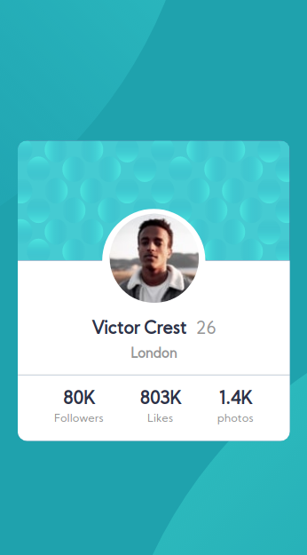

# Profile card component
https://profilecardcomponet.netlify.app/

## Sobre o projeto

Esta é uma Solução do Frontend do Mentor, o desafio era criar um componente de cartão de perfil e deixá-lo o mais próximo possível do design proposto. Nele, o usuário deve ser capaz de visualizar o cartão em qualquer dispositivo.

## Layout Desktop

## layout Mobile

# Estilização utilizada

## Cores

### Primária

- Dark cyan: hsl(185, 75%, 39%) 
- Very dark desaturated blue: hsl(229, 23%, 23%) 
- Dark grayish blue: hsl(227, 10%, 46%)

### Neutra

- Dark gray: hsl(0, 0%, 59%)

## tipografia

### Body

- Font size (name and stats): 18px

### Font

- Family: Kumbh Sans
- Weights: 400

# Tecnologias utilizadas

## Front end

- HTML / CSS 

## Implantação em produção

- Front end web: Netlify

  https://profilecardcomponet.netlify.app/
  
# Meu aprendizado neste projeto
  
  Neste projeto dei sequência no o aprendizado com o FlexBox, mas também procurei a me atentar a deixar o código mais limpo, eliminando assim linhas de códigos que perdem a função no decorrer do desenvolvimento.
  
# Autor

Wesley higino Pereira

https://www.linkedin.com/in/wesleyhigino/
